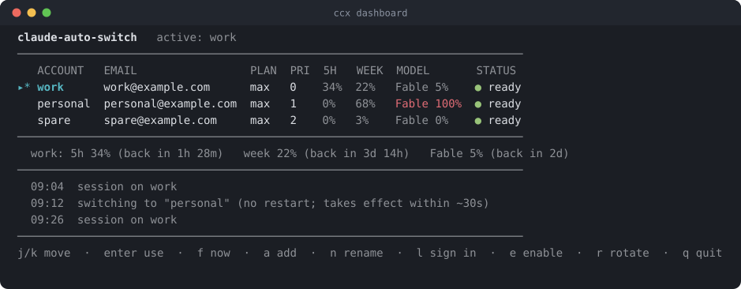
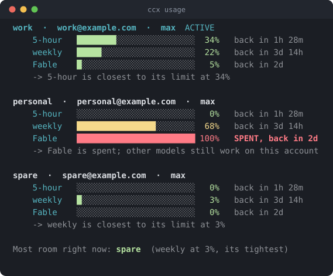

# Claude Auto-Switch (`ccx`)

**One Claude account hits its limit? ccx moves you to the next one, automatically.**
Same conversation, same model, no interruption.

Add your Claude accounts once, run `ccx on`, then use Claude the way you always
have, in your terminal or in Cursor / VS Code. The moment you hit a usage limit,
ccx checks that the limit is real, moves you to an account that still has room,
and carries your conversation with it. You never think about it again.

It runs on your own machine against your own accounts. There is no server of
ours, and no telemetry.



## Install and go

```
npm install -g claude-auto-switch

ccx add work        # log in an account (opens your browser)
ccx add personal    # add another to switch between
ccx on              # set up once: your terminal and your editor
```

That is the entire setup. Now use Claude normally.

> Adding a second account? Your browser is still signed in to the first one, so
> sign out at claude.ai first (or use a different browser profile). Otherwise
> both profiles end up holding the same account, and that is worse than useless:
> signing in again replaces a login, so renewing one profile would end the other.
> ccx **refuses** that sign-in: the profile goes back to the login it had before,
> or, if it had none, the refused login is removed rather than left active. So
> you cannot end up there by accident, whichever command you used.
> `ccx doctor` checks for it at any time.

## Using it in your terminal

After `ccx on`, just run `claude` exactly as before:

```
claude
```

ccx runs underneath, watches for the limit, and switches accounts the moment you
hit one. Nothing new to learn, nothing to remember.

> Prefer not to touch your shell? `ccx run -- <args>` runs a single session
> through ccx without installing anything.

## Using it in Cursor / VS Code

`ccx on` also points the Claude Code extension at your accounts (or run
`ccx editor on` for just the editor). Restart your editor and use Claude in it as
usual. It only changes *which account* the editor uses, never *how* it launches
Claude, so it cannot break Claude in your editor.

## Knowing where you stand

Running out of room is much less annoying when you can see it coming.

**In Claude itself.** Add one line to your Claude `settings.json` and the account
and its remaining room appear in Claude's own status line:

```json
"statusLine": { "type": "command", "command": "ccx statusline" }
```

```
work Fable 87% left              plenty of room
work Fable 22% left              getting low
! work Fable spent resets 10h    out, and when it comes back
```

Already have a status line? Keep it: `ccx statusline --wrap <your command>` runs
yours and adds ccx to the end. Add `--compact` to drop the account name if your
line already shows it. `ccx statusline --install` prints the snippet.

**On demand.** `ccx usage` spells out every window on every account, what is
closest to stopping each one, and where there is room right now:



Look at `personal` there. It is at 0% for the hour and 68% for the week, and it
still cannot run Fable, because that one model's window is spent. A single
"usage" number would hide that in one direction or the other, so ccx never shows
one: it names the window that will actually stop you, and it keeps offering that
account for the models that still work.

**Live.** `ccx dashboard` is a running view of the same thing, with keys to act
on it: `enter` to switch, `f` to switch instantly, `a` to add an account, `n` to
rename one, `l` to sign one in again, `e` to enable or disable, `r` to rotate.

## What you get

- **Switching on a real limit, not a guess.** Claude's limit message only starts
  the check; ccx then asks Anthropic whether that account is genuinely out
  before moving you. Text on screen can be a replay, or your own code talking
  about rate limits, and neither should cost you your session.
- **Your conversation continues** on the new account, in place.
- **Your history stays yours.** ccx sessions read and write your normal
  `~/.claude`, so `/resume` and project memories are exactly where they always
  were, whether you launch Claude through ccx or not.
- **Careful with your logins.** Credentials are written whole or not at all, the
  previous one is always kept, and a signed-out or damaged credential is never
  written over a good account. Before a login is copied into an account, ccx
  asks Anthropic who it belongs to, so signing in as someone else mid-session
  cannot land in the wrong account.
- **It checks before it starts, not after.** A login that has expired is renewed
  before the session begins. One that is genuinely finished is named, with the
  command that fixes it, instead of turning into Claude saying you are logged
  out for no visible reason.
- **It stays out of your way.** While Claude is running it owns the screen, so
  ccx says nothing there: it uses the terminal's own notification, the window
  title, and a log you can read later with `ccx history`.
- **Honest about what it can see.** `ccx doctor` asks Anthropic who each profile
  is really signed in as, which is the only way to catch a profile holding the
  wrong account or two profiles sharing one login.
- **It follows the model you are on.** A spent model window stops that model, not
  the account, so ccx looks for another account that still has room on the SAME
  model before it considers anything else. Only when none does will it change
  model, in a configurable order (Fable then Opus by default), and it tells you
  when that happens.
- **Optional: move before you run out.** Off by default. `ccx proactive on` hands
  the session to a roomier account as the current one approaches its limit,
  rather than waiting to hit the wall.
- **Everywhere**: Windows, macOS, Linux; terminal, headless, and editor, all
  following the same active account.

## How it works

ccx runs the real Claude for you and quietly watches its output. When Claude
reports a usage limit, ccx confirms it against your account's real usage, marks
that account as out, and moves your session to one with room, continuing the
conversation. There is one shared "active account" that your terminal and your
editor both follow, so a switch made anywhere carries everywhere.

Switching a running session is seamless: ccx swaps the login underneath it and
Claude picks it up within about half a minute, with nothing restarted. When you
want it immediately instead, `ccx use <name> --now` restarts the session on the
new account and resumes the same conversation.

---

## Commands

The two you actually use are `ccx add` and `ccx on`. The rest are here when you
want them.

| Command | What it does |
| --- | --- |
| `ccx add <name>` | Log in an account and give it its own folder |
| `ccx on` / `off` | Set up (or remove) ccx everywhere: terminal + editors |
| `ccx editor on` / `off` | Set up (or remove) just an editor (Cursor / VS Code) |
| `ccx` | A quick status glance (or a getting-started guide if you're new) |
| `ccx usage` | Real usage per account: hourly, weekly, and per model |
| `ccx statusline` | One line for Claude's status line (`--wrap`, `--compact`) |
| `ccx dashboard` (alias `watch`) | Live view of every account, with keys to act |
| `ccx doctor` | Check the whole setup, including who each profile really is |
| `ccx use <name>` | Make an account active (`--now` to switch instantly) |
| `ccx rotate` | Switch to the next healthy account now |
| `ccx proactive on` / `off` | Move to a roomier account before running out |
| `ccx auto` | Do that check once now (`--once`, `--json`, for scripts) |
| `ccx list` / `status [name]` | Account health (email, plan, signed in, capped until) |
| `ccx enable` / `disable <name>` | Include or exclude an account from switching |
| `ccx priority <name> <n>` | Set the order accounts are tried (lower first) |
| `ccx login <name>` / `--all` | Sign a stale account back in |
| `ccx remove <name>` | Remove an account (`--purge` also deletes its folder) |
| `ccx setup` | Shows your next step, wherever you are in setup |
| `ccx history` | What ccx has done to your logins, and when |
| `ccx cap <name>` | Mark an account limited by hand, or `--clear` one that is not |
| `ccx daemon install` | Always-on rotation, including outside a terminal |
| `ccx run -- <args>` | Run a one-off through ccx without installing the shim |

## Configuration

Everything works with no config. To tune it, add an optional
`~/.claude-auto-switch/config.json` (every key is optional):

```json
{
  "priorityOrder": ["personal", "work"],
  "rotation": {
    "modelPreference": ["fable", "opus"],
    "modelStrategy": "model-first",
    "preferSameModel": true,
    "defaultBackoffMinutes": 300,
    "proactivePercent": 0,
    "usageCheckSeconds": 300
  }
}
```

### Which runs out first, the model or the account

`ccx models` shows and sets this; the config keys are there if you prefer to
edit the file.

```
ccx models                            what you have now
ccx models fable opus                 use Fable, fall back to Opus
ccx models fable                      only ever Fable, never fall back
ccx models --strategy account-first   use each account up instead
```

`modelStrategy` picks the rule rotation follows:

- **model-first** (the default) uses up the CURRENT MODEL everywhere before
  changing model: Fable on every account, and only when the last one is gone
  does it fall back to Opus and start again from your first account. This is
  what "stay on Fable as long as possible" means.
- **account-first** uses up each ACCOUNT before moving on: Fable then Opus on
  this account, then the same on the next one.

`modelPreference` is the chain both strategies walk. A chain of one
(`["fable"]`) means never fall back: when Fable is gone everywhere ccx says so
rather than moving you to a model you did not choose. `preferSameModel: false`
ignores models entirely and rotates on account limits alone (interactive
sessions only; headless runs always plan by model).

Both ways of running follow this: an interactive session and a headless
`ccx -p ...` request use the same planner, so the setting means one thing.

This applies only when a model is actually in play, meaning you passed
`--model` or pinned one in your session `settings.json`. With nothing pinned,
Claude picks its own default, ccx has no way to read which one that is, and
imposing a model you never asked for would be the wrong answer. Those sessions
rotate on account capacity alone.


- `priorityOrder`: which accounts to prefer, in order (for example, burn the
  personal one first and save work for last).
- `rotation.defaultBackoffMinutes`: how long to treat an account as out when
  Claude does not say when it resets.
- `rotation.proactivePercent`: move off an account once its binding limit reaches
  this percent. `0` is off, which is the default; `ccx proactive on` sets it.
- `rotation.usageCheckSeconds`: how often a running session checks its own usage.

## Requirements and platform notes

Node.js 20 or newer. Installing compiles one small native piece
([`node-pty`](https://github.com/microsoft/node-pty)), so you need your OS's
usual build tools (a C/C++ toolchain).

Windows and Linux switch accounts by swapping the account's login file behind the
scenes. macOS keeps logins in the Keychain, which a separate folder cannot
isolate, so on macOS each account uses a long-lived token (created once per
account with `ccx token <name>`); normal coding is unaffected. `ccx doctor` tells
you which applies to your machine.

## Your credentials stay yours

There is no server of ours and no telemetry. ccx talks to Anthropic for exactly
three things, all about your own accounts: reading your usage, renewing your own
login when it goes stale, and asking which account a login belongs to. That last
one is what stops a login being copied into the wrong account, and it is asked
only when a stored login changes. Nothing else leaves your machine.

Each account's login is the same one Claude Code already saves, kept in its own
folder under `~/.claude-auto-switch/`, written owner-only, and never committed.
Logins are created through your normal browser, so ccx never sees your password.
See [SECURITY.md](SECURITY.md) for the full picture.

One honest note: using several paid accounts to stretch your usage sits in a gray
area of Anthropic's terms, so use your own judgment.

## Development

```
npm run verify   # typecheck + lint + tests
```

Tests never touch a real account or spend model usage: everything runs against a
fake `claude` (see `test/fake-claude/`).

## License

MIT. See [LICENSE](LICENSE).
