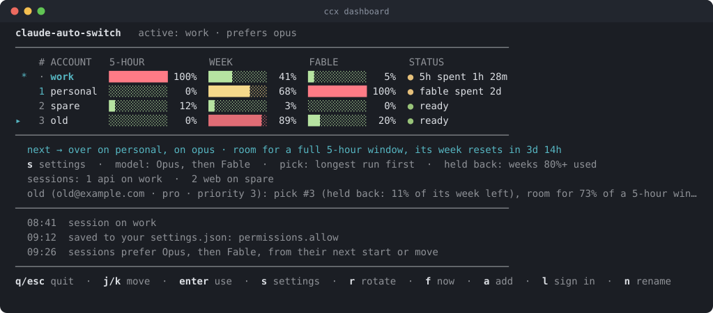
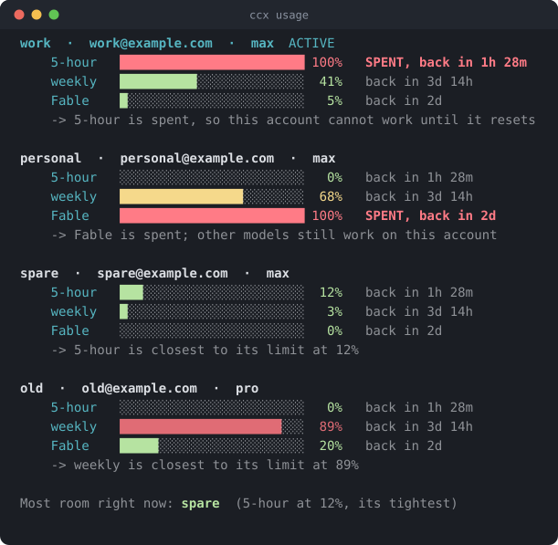
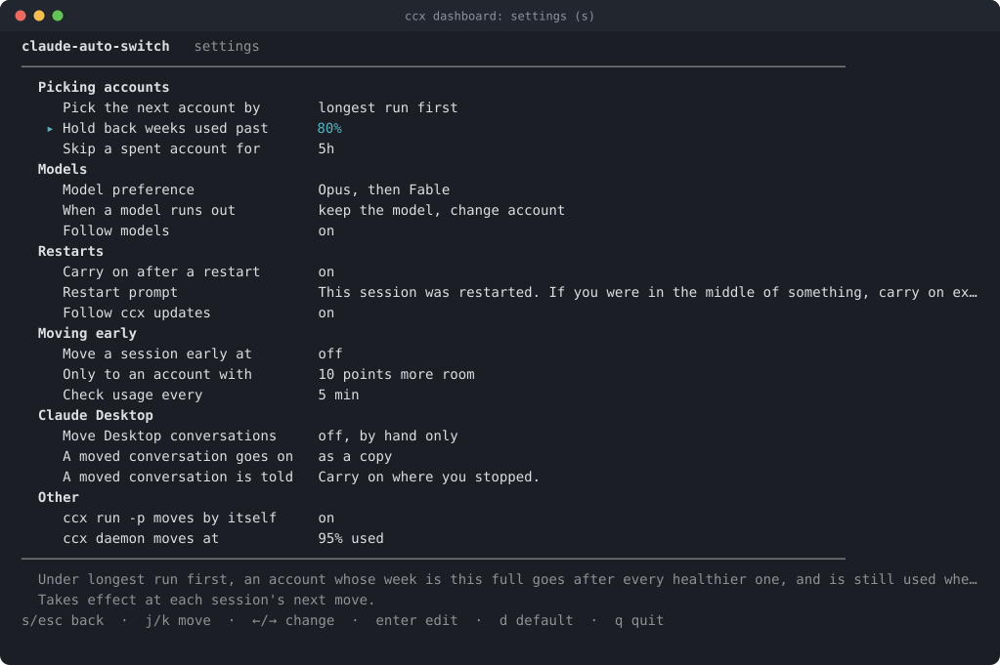

# ccx (claude-auto-switch)

Run Claude Code across several of your Claude accounts. When one account's
usage is spent, ccx moves the session to another account and the conversation
carries on: same terminal, same conversation, same model.

It runs on your machine against your own accounts. No server, no telemetry.



## Quick start

```sh
npm install -g claude-auto-switch
ccx add work        # sign in through your browser
ccx add personal    # sign out of claude.ai first, or use another browser profile
ccx on              # route `claude` through ccx
claude              # use Claude as usual
```

`ccx on` sets up four things, and `ccx off` removes them:

- a `claude` function in your shell profile that runs Claude through ccx
- the Claude Code extension in Cursor and VS Code
- ccx's part of Claude's status line (an existing status line is kept, wrapped)
- the `/ccx` command inside Claude

`ccx doctor` checks the whole setup, including which account each profile is
really signed in as. Two profiles holding one account would end each other's
logins on renewal, so ccx refuses such a sign-in and keeps the previous login.

## How it works

**A config folder per session.** Claude reads its login from its config folder
(`CLAUDE_CONFIG_DIR`). ccx runs each session on its own folder,
`~/.claude-auto-switch/sessions/<pid>`, holding that session's login. Changing
account means replacing that login; Claude picks it up within about 30 seconds,
without a restart.

**Everything else is your `~/.claude`.** The session folder links your projects
and transcripts, prompt history, `/rewind` checkpoints, plugins, skills, agents,
todos and memory. Settings start as a copy of your `settings.json`. What Claude
changes during a session (a model picked with `/model`, a permission, a hook, an
MCP server, a trusted folder) is merged back into your own `settings.json` and
`~/.claude.json`, and logged. If you changed the same setting elsewhere, yours
wins.

**Detecting a spent account.** Claude writes every refused turn into the
conversation's transcript, with error codes. ccx reads that record, never the
screen, and confirms against the account's real usage before it acts. Text on
screen that talks about usage limits never moves a session.

**Moving.** A refused turn has already ended, so ccx relaunches Claude on the
next account with `--resume <conversation>` and a short carry-on prompt (set it
with `ccx resume-prompt`, or `resume` in the config). A switch you make yourself
(`ccx use`, `/ccx`) happens in place.

**One session at a time.** Each session moves on its own: a refused turn moves
that session and no other. A switch you make from the dashboard or with
`ccx use` moves the only running session, or, with several running, the ones
you name (`ccx use <name> --session <pid>`, `--here`, `--all`; the dashboard
asks).

**Updates.** When a newer ccx is installed, each running session moves to it
when Claude is next relaunched or has been idle for 20 seconds, never mid-turn.

## Which account is next

`ccx order`, `o` in the dashboard, or its settings (`s`) pick the rule:

- **smart** (default): the account that can run longest before any window stops
  it. An account has a 5-hour window, a weekly window, and a weekly window per
  model (Fable). ccx measures them in one unit, full 5-hour windows of work:
  weekly room is converted using what one 5-hour window costs that account's
  week, learned from its own readings (15% until measured). So a 5-hour window
  90% used, or a week 99% used, both mean almost no runway.
  - A week 80% or more used (the account's, or the model's own) is **held
    back**: that account comes after every healthy account that can run at
    least half a 5-hour window, however fresh its own window. What is left of a
    nearly spent week is the least certain number on screen, a second session
    can drain it twice as fast, and kept for last it bridges the hours when
    every healthy account is waiting on its 5-hour window. Against a healthy
    account with less than half a window, it competes on runway: holding back a
    full window for 40% of one would only mean another move within two hours.
    Set the line with `ccx config holdBackAtPercent <50-99|off>`.
  - Among accounts within a tenth of a window of each other, the one whose
    leftover weekly budget would expire unused soonest goes first, then your
    priority order.
  - An account with under a quarter window left is used only when nothing
    better exists: a move rereads the whole conversation without a cache.
- **most-room**: the least-used account, by its tighter percentage.
- **priority**: your own order, set with `ccx priority <name> <n>` or `[` and `]`
  in the dashboard.

A pinned account (`ccx use <name>`) always wins.

## Models

A spent model window stops that model, not the account. ccx keeps a session on
its model while any account has room for it, and only then moves down your
preference chain:

```sh
ccx models                            # show the current chain
ccx models opus fable                 # Opus, then Fable (the default)
ccx models opus                       # Opus only, never fall back
ccx models --strategy account-first   # use each account up across the chain instead
```

`M` in the dashboard cycles the common chains, and its settings (`s`) take a
chain of your own. This applies when a model is in play (`--model`, or `model`
in your settings); otherwise ccx rotates on account capacity alone.

## Seeing where you stand

- **Status line**: the account and its tightest window, e.g. `work 5h 64% left`
  or `! work week spent resets 2d`.
- **`ccx usage`**: every window on every account, with reset times.
- **`ccx dashboard`**: a live view. `#` is the pick order, `next →` says where
  the session goes next and why, and `sessions:` which session is on which
  account.



`s` in the dashboard opens the settings: every setting with its value, what it
does, and when a change reaches running sessions. The arrows step a value, enter
types one, `d` puts the default back. `ccx config` shows and sets the same
settings from a shell.



| Dashboard key   | Action                                                                                                |
| --------------- | ----------------------------------------------------------------------------------------------------- |
| `enter`         | make the highlighted account the one new sessions start on, and move a running session to it in place |
| `f`             | the same, restarting the session on it instead                                                        |
| `s`             | settings                                                                                              |
| `r`             | rotate to the next pick                                                                               |
| `M` / `o`       | cycle the model preference / the pick rule                                                            |
| `[` / `]`       | move the highlighted account up / down your priority order                                            |
| `e`             | enable or disable the highlighted account                                                             |
| `a` `n` `l`     | add an account, rename one, sign one in again                                                         |
| `d` `m` `t` `D` | Claude Desktop: handoff, mode, carry-on text, move a conversation                                     |
| `q` / `esc`     | quit                                                                                                  |

## Claude Desktop

Desktop runs its conversations on its own signed-in account, and nothing outside
Desktop can switch them. ccx moves a Desktop conversation to a terminal instead,
where it does switch, keeping its history, model, effort and permission mode:

```sh
ccx desktop                   # Desktop's account and its open conversations
ccx desktop move 2            # continue conversation 2 in a terminal (--wait)
ccx desktop handoff credits   # move by itself: off | limit | credits
```

- `handoff limit` moves a conversation when its turn is refused.
- `handoff credits` also holds back a message once Desktop's account is past its
  plan, so Desktop never spends usage credits.
- Both are hooks in `~/.claude/settings.json`. A moved conversation continues as
  a copy (`ccx desktop mode fork`, the default) or as itself (`mode same`).

## Inside Claude: `/ccx`

`/ccx` shows every account's room and swaps the current session to the one you
pick: in place in a ccx session, or, in Claude Desktop, by continuing the
conversation in a terminal. From a shell, `ccx swap [name]` does the same.

## Workers: one task, one account

A Claude Code subagent shares its parent's single login, so every subagent
spends the same account. `ccx worker` runs a task headless (`claude -p`) as its
own process, on the account ccx picks for it, for an orchestrator: a Claude
session handing work out, or a program of your own.

```sh
ccx worker --agent coder --cwd ../wt-billing --permission-mode acceptEdits \
  "Make the billing retry idempotent. Run npm test before you finish."
```

It runs as your own Claude (your agents, settings and MCP servers), spreads
across accounts other sessions are not using, and when its account runs out it
resumes the same conversation on the next one instead of starting the task
over. It prints Claude's answer (JSON by default) with the accounts that did
the work. See [workers](docs/workers.md) for the options, output, agent
definitions and parallel coders in git worktrees.

## Commands

| Command                                  | What it does                                                                                                             |
| ---------------------------------------- | ------------------------------------------------------------------------------------------------------------------------ |
| `ccx worker [brief...]`                  | one task headless on an account, for an orchestrator (`--agent`, `--account`, `--cwd`, `--timeout`; see docs/workers.md) |
| `ccx add <name>`                         | add an account and sign it in through the browser                                                                        |
| `ccx on` / `ccx off`                     | set up / remove ccx in your shell, editors, status line and `/ccx`                                                       |
| `ccx`                                    | status at a glance (a setup guide when nothing is set up)                                                                |
| `ccx dashboard`                          | live view with keys (alias `watch`)                                                                                      |
| `ccx usage`                              | every window on every account                                                                                            |
| `ccx use <name>`                         | make an account active and move the only running session (`--now` restarts; `--session <pid>`, `--here`, `--all`)        |
| `ccx config [key] [value]`               | every setting; one explained; one changed (`default` resets it)                                                          |
| `ccx sessions`                           | the ccx sessions running now: pid, account, folder                                                                       |
| `ccx swap [name]`                        | the room on every account; swap this session                                                                             |
| `ccx rotate`                             | switch to the next pick now                                                                                              |
| `ccx order [smart\|most-room\|priority]` | the pick rule                                                                                                            |
| `ccx models [models...]`                 | the model chain (`--strategy model-first\|account-first`)                                                                |
| `ccx priority <name> <n>`                | an account's place in your order (lower first)                                                                           |
| `ccx enable` / `disable <name>`          | include / exclude an account                                                                                             |
| `ccx proactive on\|off`                  | move before an account runs out (off by default)                                                                         |
| `ccx auto`                               | run that check once (`--once`, `--json`)                                                                                 |
| `ccx resume-prompt "<text>"`             | what a session is told after a relaunch (`--clear`)                                                                      |
| `ccx run -- <args>`                      | run one Claude session through ccx without `ccx on`                                                                      |
| `ccx desktop [...]`                      | Claude Desktop: status, `move`, `handoff`, `mode`, `prompt`                                                              |
| `ccx login <name>` / `--all`             | sign a stale account back in                                                                                             |
| `ccx list` / `status [name]`             | account health: email, plan, signed in, capped until                                                                     |
| `ccx doctor`                             | check the setup and who each profile really is                                                                           |
| `ccx history`                            | what ccx did to logins, sessions and your settings                                                                       |
| `ccx state`                              | everything ccx knows, as JSON                                                                                            |
| `ccx cap <name>`                         | mark an account out by hand (`--clear`)                                                                                  |
| `ccx token <name>`                       | mint a long-lived token for headless use                                                                                 |
| `ccx statusline`                         | the status line itself (`--install` prints the snippet, `--compact`)                                                     |
| `ccx setup`                              | the next setup step, wherever you are                                                                                    |
| `ccx editor on\|off`                     | set up / remove just the editor                                                                                          |
| `ccx daemon install`                     | always-on rotation outside a terminal                                                                                    |
| `ccx remove <name>`                      | remove an account (`--purge` also deletes its folder)                                                                    |

## Configuration

`~/.claude-auto-switch/config.json`. Every key is optional. Change one with
`ccx config <key> <value>` or the dashboard's settings (`s`), which check the
value first; running sessions pick a change up at their next move, restart or
usage check, as `ccx config <key>` says.

| Key                                    | Default                         | Meaning                                                           |
| -------------------------------------- | ------------------------------- | ----------------------------------------------------------------- |
| `rotation.accountOrder`                | `"smart"`                       | `smart`, `most-room` or `priority`                                |
| `rotation.holdBackAtPercent`           | `80`                            | smart: a week this full waits behind healthy accounts (`100` off) |
| `rotation.modelPreference`             | `["opus", "fable"]`             | the model chain                                                   |
| `rotation.modelStrategy`               | `"model-first"`                 | or `account-first`                                                |
| `rotation.preferSameModel`             | `true`                          | `false` ignores models and rotates on account capacity alone      |
| `rotation.proactivePercent`            | `0`                             | move once the tightest window reaches this percent (`0` is off)   |
| `rotation.proactiveHysteresisPercent`  | `10`                            | the target needs this many points more room                       |
| `rotation.usageCheckSeconds`           | `300`                           | how often a session reads its own usage                           |
| `rotation.defaultBackoffMinutes`       | `300`                           | how long an account counts as out when no reset time is known     |
| `rotation.autoRotateHeadless`          | `true`                          | headless runs (`claude -p`) rotate too                            |
| `rotation.capThresholdPercent`         | `95`                            | the daemon's threshold for treating an account as out             |
| `resume.auto`                          | `true`                          | send the carry-on prompt after a relaunch                         |
| `resume.prompt`                        | "This session was restarted..." | the carry-on prompt                                               |
| `update.follow`                        | `true`                          | running sessions move to a newer installed ccx                    |
| `desktop.handoff`                      | `"off"`                         | `off`, `limit` or `credits`                                       |
| `desktop.mode`                         | `"fork"`                        | `fork` or `same`                                                  |
| `desktop.prompt`                       | "Carry on where you stopped."   | what a moved Desktop conversation continues with                  |
| `realClaudePath`                       | found on `PATH`                 | the real `claude` binary, when finding it fails                   |
| `browser.debugPort`, `browser.channel` | `9222`, `"chrome"`              | the browser `ccx add` and `ccx login` use                         |

## What ccx writes

| Where                                    | What                                                                  |
| ---------------------------------------- | --------------------------------------------------------------------- |
| `~/.claude-auto-switch/profiles/<name>/` | each account's login, owner-only (separate Keychain entries on macOS) |
| `~/.claude-auto-switch/sessions/<pid>/`  | per-session config folders, cleared after the session ends            |
| `~/.claude-auto-switch/config.json`      | your settings                                                         |
| `~/.claude-auto-switch/events.jsonl`     | what ccx did (`ccx history`)                                          |
| `~/.claude-auto-switch/rescued/`         | session changes that could not be merged back                         |
| `~/.claude/settings.json`                | the `statusLine` key; the Desktop hooks when enabled; session changes |
| `~/.claude.json`                         | session changes to your preferences, MCP servers and folder trust     |
| `~/.claude/skills/ccx/`                  | the `/ccx` command                                                    |
| your shell profile                       | the `claude` function                                                 |
| Cursor / VS Code settings                | `claudeCode.environmentVariables`                                     |

To read ccx from another program, use `ccx state`; the files above are internal
and change between releases. See
[reading ccx from another program](docs/reading-ccx-from-another-program.md).

## Privacy and security

ccx talks to Anthropic only about your own accounts: reading usage, renewing a
stale login, and asking which account a login belongs to, so a login is never
stored under the wrong account. Logins come from your browser sign-in; ccx never
sees a password. See [SECURITY.md](SECURITY.md).

Using several paid accounts to extend your usage may conflict with Anthropic's
terms. Use your own judgment.

## Requirements

Node.js 20 or newer, on Windows, macOS or Linux. Installing builds
[`node-pty`](https://github.com/microsoft/node-pty), which needs your platform's
C/C++ build tools.

## Development

```sh
npm run verify   # typecheck, lint and tests
```

Tests run against a fake `claude` (`test/fake-claude/`): no real account, no
model usage.

## License

MIT. See [LICENSE](LICENSE).
